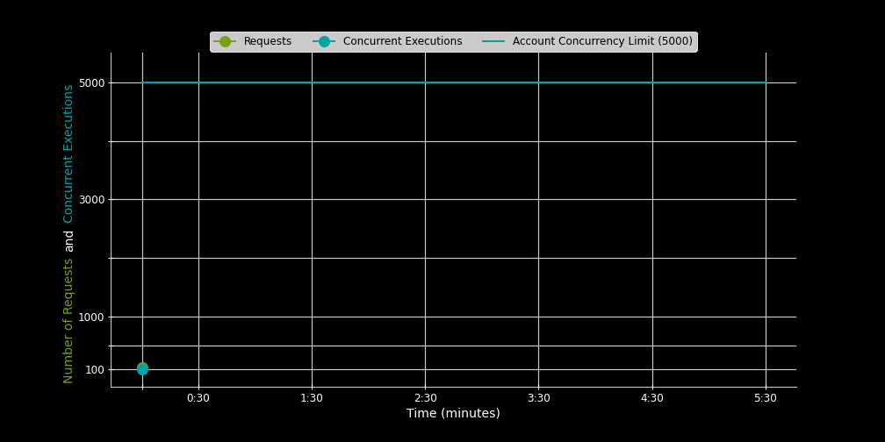

# Illustration of how Lambda handles traffic bursts

## 📌 Overview
This code illustrates how AWS Lambda manages traffic bursts by depicting the number of requests, concurrency limits, and the scaling of concurrent executions. I would like to know how the application will react to a sudden influx of requests. Notably, all of the account's concurrency may not be available immediately, which can result in requests being throttled for several minutes, even when the overall limit exceeds the incoming surge.

## 🖥️ Features
- 📊 Displays the number of requests and concurrent executions over time. 
- 🔹 Emphasizes AWS Lambda's concurrency scaling with annotations. 
- 🌑 Utilizes a **dark-themed** visualization for enhanced readability.

## 📦 Requirements
Ensure you have Python and the following libraries installed:

pip install matplotlib numpy

## 🚀 Usage
Run the script to generate and display the graph:

python lambda_concurrency_plot.py

## 📝 Explanation

- Green Line: Indicates the number of requests received.
- Blue Line: Reflects the number of concurrent executions.
- Orange Line: Denotes the concurrency limit established for AWS Lambda.
- Annotations: Clarify the process by which Lambda scales its concurrency.
- Account Concurrency Limit: 5000
- Immediate Concurrency Increase: 3000
   - In the event of a sudden surge in requests, AWS Lambda will promptly increase the concurrency level by the predetermined "Immediate Concurrency Increase" amount applicable to the specific region where the Lambda function is deployed.
- Incremental Invocations: 
   - Lambda will augment its capacity by adding 500 invocations per minute. This process will continue until Lambda successfully accommodates the influx of requests or reaches the established function or account concurrency limits.

# 🌈 Color Reference

The following colors are utilized in the visualization:

| Hex Code  | Color Name  |
|-----------|------------|
| `#7AA116` | Green      |
| `#00A4A6` | Dark Teal  |
| `#C925D1` | Purple     | 
| `#ED7100` | Orange     |
| `#000000` | Black     |

🕘 Clock Values:

| Hand Name  | Degrees per Unit
|-----------|------------|
| `Second` | 6° per second      |
| `Minute` | 6° per minute  |
| `Hour` | 30° per hour (0.5° per minute)     |

## 📸 Output

## 💡 Contributing
Feel free to fork this repository and submit pull requests to improve the script.

## 🛠️ License
This project is licensed under the MIT License.

## Initialize a Git Repository
Inside the project folder, run:

- git init
- git add .
- git commit -m "Initial commit: Lambda Concurrency Graph"

## Push to GitHub
1) Create a GitHub repository with a relevant name like lambda-concurrency-graph.
2) Link the remote repository:
git remote add origin https://github.com/YOUR-USERNAME/lambda-concurrency-graph.git
3) Push the code:
git branch -M main
git push -u origin main

## Final Notes
If you make changes, always commit and push:

- git add .
- git commit -m "Updated the graph annotations"
- git push origin main

